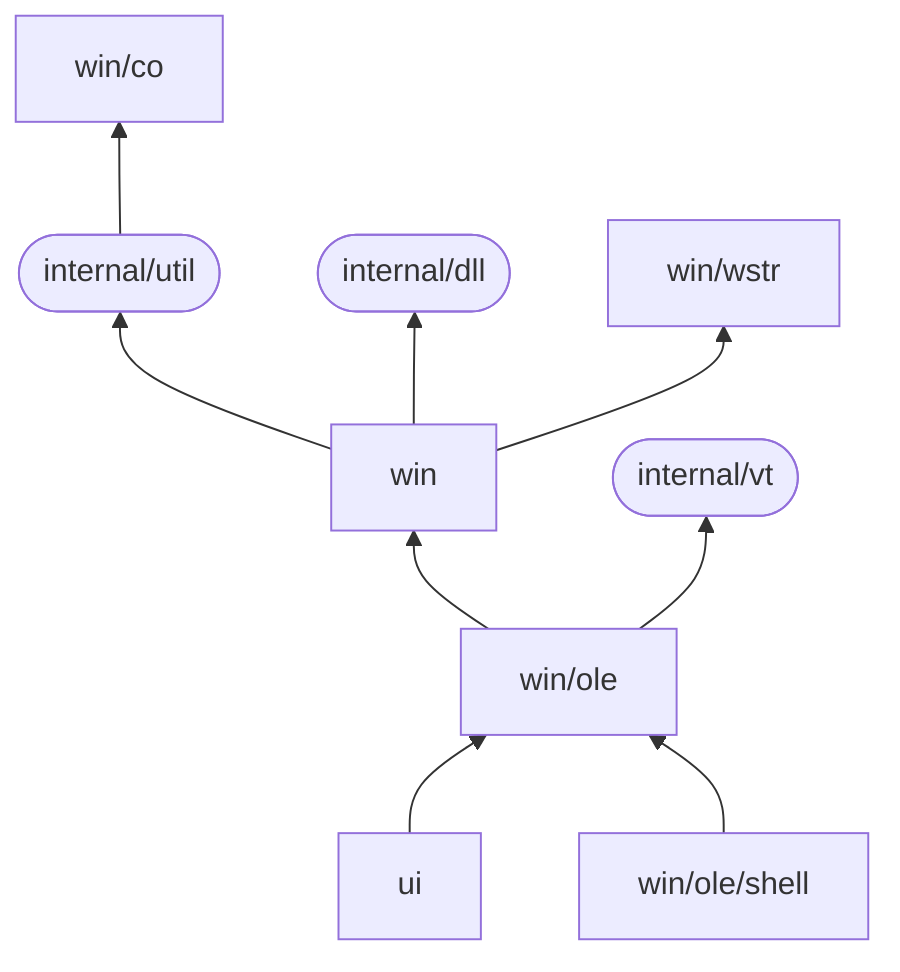

[](https://pkg.go.dev/github.com/rodrigocfd/windigo@v0.2.0)


# Windigo

Win32 API and GUI in idiomatic Go.

Windigo is designed to be familiar to C/C++ Win32 programmers, using the same concepts, and an API as close as possible to the original Win32 API. This allows most C/C++ Win32 tutorials and examples to be translated to Go.

Notably, Windigo is written 100% in pure Go – CGo is **not** used, just native syscalls.


## Example

The example below creates a window programmatically, and handles the button click. Also, it uses the `minimal.syso` provided in the [resources](resources/) folder.


```go
package main

import (
	"fmt"
	"runtime"

	"github.com/rodrigocfd/windigo/ui"
	"github.com/rodrigocfd/windigo/win/co"
)

func main() {
	runtime.LockOSThread()

	myWindow := NewMyWindow() // instantiate
	myWindow.wnd.RunAsMain()  // ...and run
}

// This struct represents our main window.
type MyWindow struct {
	wnd     *ui.Main
	lblName *ui.Static
	txtName *ui.Edit
	btnShow *ui.Button
}

// Creates a new instance of our main window.
func NewMyWindow() *MyWindow {
	wnd := ui.NewMain( // create the main window
		ui.OptsMain().
			Title("Hello you").
			Size(ui.Dpi(340, 80)).
			ClassIconId(101), // ID of icon resource, see resources folder
	)

	lblName := ui.NewStatic( // create the child controls
		wnd,
		ui.OptsStatic().
			Text("Your name").
			Position(ui.Dpi(10, 22)),
	)
	txtName := ui.NewEdit(
		wnd,
		ui.OptsEdit().
			Position(ui.Dpi(80, 20)).
			Width(ui.DpiX(150)),
	)
	btnShow := ui.NewButton(
		wnd,
		ui.OptsButton().
			Text("&Show").
			Position(ui.Dpi(240, 19)),
	)

	me := &MyWindow{wnd, lblName, txtName, btnShow}
	me.events()
	return me
}

func (me *MyWindow) events() {
	me.btnShow.On().BnClicked(func() {
		msg := fmt.Sprintf("Hello, %s!", me.txtName.Text())
		me.wnd.Hwnd().MessageBox(msg, "Saying hello", co.MB_ICONINFORMATION)
	})
}
```

## Architecture

The library is divided in two main packages:

* `ui` – high-level windows and controls;
* `win` – low-level native Win32 bindings.

More specifically:

| Package | Description |
| - | - |
| `ui` | High-level UI windows and controls. |
| `win` | Native Win32 structs, handles and functions. |
| `win/co` | Native Win32 constants, all typed. |
| `win/ole` | COM bindings. |
| `win/ole/shell` | Shell COM bindings. |
| `win/wstr` | String and UTF-16 wide string management. |

Internal package dependency:



## Legacy version

As of May 2025, Windigo was heavily refactored, featuring:

* simpler package organization;
* more strict error handling;
* more performant [UTF-16](https://learn.microsoft.com/en-us/windows/win32/learnwin32/working-with-strings) string conversion, with short string optimization;
* a new [COM](https://en.wikipedia.org/wiki/Component_Object_Model) implementation.

If, for some reason, you can't upgrade right now, just point your go.mod to the old version:

```
go get github.com/rodrigocfd/windigo@v0.1.0
```

## License

Licensed under [MIT license](https://opensource.org/licenses/MIT), see [LICENSE.md](LICENSE.md) for details.
