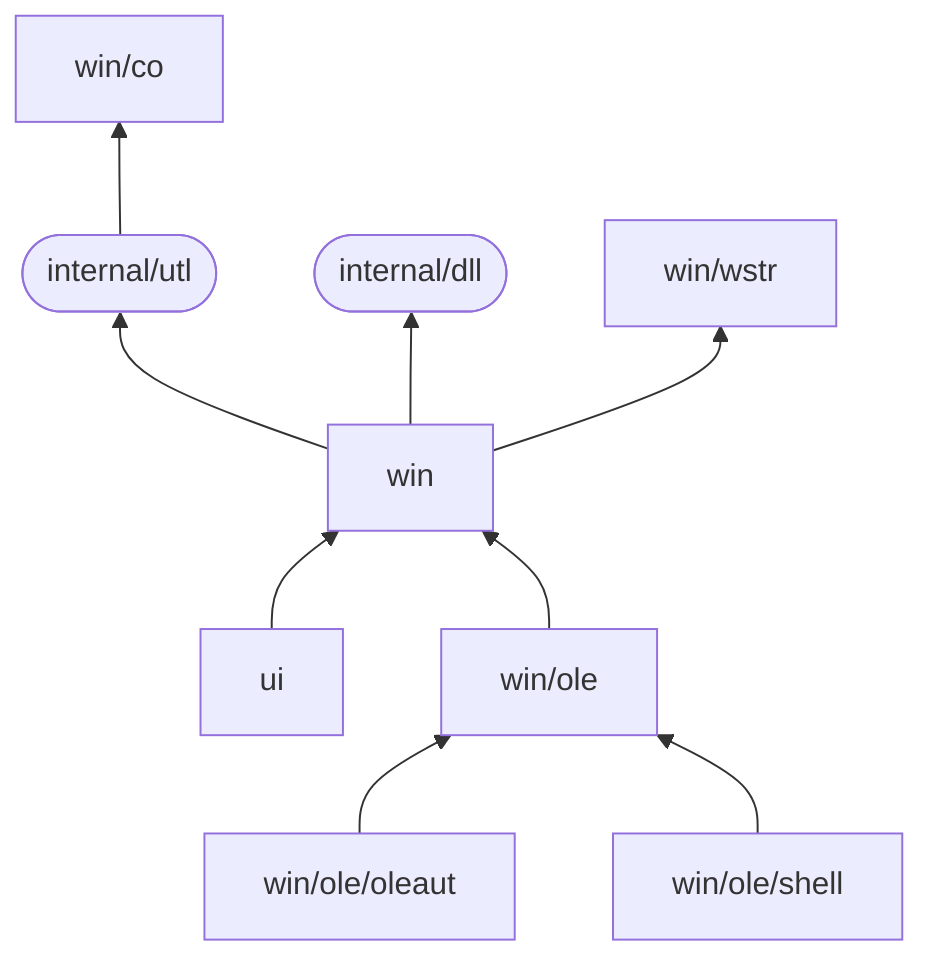

[](https://pkg.go.dev/github.com/rodrigocfd/windigo@v0.2.0)
[](https://github.com/rodrigocfd/windigo)
[](https://github.com/rodrigocfd/windigo)
[](https://github.com/rodrigocfd/windigo/blob/master/LICENSE.md)

# Windigo

Win32 API and GUI in idiomatic Go.

Windigo is designed to be familiar to C/C++ Win32 programmers, using the same concepts, and an API as close as possible to the original Win32 API. This allows most C/C++ Win32 tutorials and examples to be translated to Go.

Notably, Windigo is written 100% in pure Go – CGo is **not** used, just native syscalls. 

## Examples

In the examples below, error checking is ommited for brevity.

<details>
<summary>GUI window</summary>

### GUI window

The example below creates a window programmatically, and handles the button click. Also, it uses the `minimal.syso` provided in the [resources](resources/) folder.


```go
package main

import (
	"fmt"
	"runtime"

	"github.com/rodrigocfd/windigo/ui"
	"github.com/rodrigocfd/windigo/win/co"
)

func main() {
	runtime.LockOSThread() // important: Windows GUI is single-threaded

	myWindow := NewMyWindow() // instantiate
	myWindow.wnd.RunAsMain()  // ...and run
}

// This struct represents our main window.
type MyWindow struct {
	wnd     *ui.Main
	lblName *ui.Static
	txtName *ui.Edit
	btnShow *ui.Button
}

// Creates a new instance of our main window.
func NewMyWindow() *MyWindow {
	wnd := ui.NewMain( // create the main window
		ui.OptsMain().
			Title("Hello you").
			Size(ui.Dpi(340, 80)).
			ClassIconId(101), // ID of icon resource, see resources folder
	)

	lblName := ui.NewStatic( // create the child controls
		wnd,
		ui.OptsStatic().
			Text("Your name").
			Position(ui.Dpi(10, 22)),
	)
	txtName := ui.NewEdit(
		wnd,
		ui.OptsEdit().
			Position(ui.Dpi(80, 20)).
			Width(ui.DpiX(150)),
	)
	btnShow := ui.NewButton(
		wnd,
		ui.OptsButton().
			Text("&Show").
			Position(ui.Dpi(240, 19)),
	)

	me := &MyWindow{wnd, lblName, txtName, btnShow}
	me.events()
	return me
}

func (me *MyWindow) events() {
	me.btnShow.On().BnClicked(func() {
		msg := fmt.Sprintf("Hello, %s!", me.txtName.Text())
		me.wnd.Hwnd().MessageBox(msg, "Saying hello", co.MB_ICONINFORMATION)
	})
}
```

To compile the final `.exe` file, run the command:

```
go build -ldflags "-s -w -H=windowsgui"
```
</details>

<details>
<summary>Registry access</summary>

### Registry access

```go
package main

import (
	"github.com/rodrigocfd/windigo/win"
	"github.com/rodrigocfd/windigo/win/co"
)

func main() {
	// Open a registry key

	hKey, _ := win.HKEY_CURRENT_USER.RegOpenKeyEx(
		"Control Panel\\Mouse",
		co.REG_OPTION_NONE,
		co.KEY_READ) // open key as read-only
	defer hKey.RegCloseKey()

	// Read a single value from this key

	regVal, _ := hKey.RegQueryValueEx("Beep") // data can be string, uint32, etc.

	if strVal, ok := regVal.Sz(); ok { // try to extract a string value
		println("Beep is", strVal)
	}

	// Enumerate all values under this key

	allValues, _ := hKey.RegEnumValue()
	for _, value := range allValues {
		regVal, _ := hKey.RegQueryValueEx(value)

		if strVal, ok := regVal.Sz(); ok { // does it contain a string?
			println("Value str", value, strVal)
		} else if intVal, ok := regVal.Dword(); ok { // does it contain an uint32?
			println("Value int", value, intVal)
		} else {
			println("Value other", value, regVal.Type())
		}
	}
}
```
</details>

<details>
<summary>Enumerating running processes</summary>

### Enumerating running processes

The example below takes a [process snapshot](https://learn.microsoft.com/en-us/windows/win32/toolhelp/taking-a-snapshot-and-viewing-processes) to list the running processes:

```go
package main

import (
	"github.com/rodrigocfd/windigo/win"
	"github.com/rodrigocfd/windigo/win/co"
)

func main() {
	hSnap, _ := win.CreateToolhelp32Snapshot(co.TH32CS_SNAPPROCESS, 0)
	defer hSnap.CloseHandle()

	processes, _ := hSnap.EnumProcesses()
	for _, nfo := range processes {
		println("PID:", nfo.Th32ProcessID, "name:", nfo.SzExeFile())
	}

	println(len(processes), "found")
}
```
</details>

<details>
<summary>Taking a screenshot</summary>

### Taking a screenshot

This complex example takes a screenshot using [GDI](https://learn.microsoft.com/en-us/windows/win32/gdi/windows-gdi) and saves it to a BMP file.

```go
package main

import (
	"unsafe"

	"github.com/rodrigocfd/windigo/win"
	"github.com/rodrigocfd/windigo/win/co"
)

func main() {
	cxScreen := win.GetSystemMetrics(co.SM_CXSCREEN)
	cyScreen := win.GetSystemMetrics(co.SM_CYSCREEN)

	hdcScreen, _ := win.HWND(0).GetDC()
	defer win.HWND(0).ReleaseDC(hdcScreen)

	hBmp, _ := hdcScreen.CreateCompatibleBitmap(uint(cxScreen), uint(cyScreen))
	defer hBmp.DeleteObject()

	hdcMem, _ := hdcScreen.CreateCompatibleDC()
	defer hdcMem.DeleteDC()

	hBmpOld, _ := hdcMem.SelectObjectBmp(hBmp)
	defer hdcMem.SelectObjectBmp(hBmpOld)

	hdcMem.BitBlt(
		win.POINT{X: 0, Y: 0},
		win.SIZE{Cx: cxScreen, Cy: cyScreen},
		hdcScreen,
		win.POINT{X: 0, Y: 0},
		co.ROP_SRCCOPY,
	)

	bi := win.BITMAPINFO{
		BmiHeader: win.BITMAPINFOHEADER{
			BiWidth:       cxScreen,
			BiHeight:      cyScreen,
			BiPlanes:      1,
			BiBitCount:    32,
			BiCompression: co.BI_RGB,
		},
	}
	bi.BmiHeader.SetBiSize()

	bmpObj, _ := hBmp.GetObject()
	bmpSize := bmpObj.CalcBitmapSize(bi.BmiHeader.BiBitCount)

	rawMem, _ := win.GlobalAlloc(co.GMEM_FIXED|co.GMEM_ZEROINIT, bmpSize)
	defer rawMem.GlobalFree()

	bmpSlice, _ := rawMem.GlobalLockSlice()
	defer rawMem.GlobalUnlock()

	hdcScreen.GetDIBits(hBmp, 0, uint(cyScreen), bmpSlice, &bi, co.DIB_RGB_COLORS)

	var bfh win.BITMAPFILEHEADER
	bfh.SetBfType()
	bfh.SetBfOffBits(uint32(unsafe.Sizeof(bfh) + unsafe.Sizeof(bi.BmiHeader)))
	bfh.SetBfSize(bfh.BfOffBits() + uint32(bmpSize))

	fo, _ := win.FileOpen("C:\\Temp\\screenshot.bmp", co.FOPEN_RW_OPEN_OR_CREATE)
	defer fo.Close()

	fo.Write(bfh.Serialize())
	fo.Write(bi.BmiHeader.Serialize())
	fo.Write(bmpSlice)
}
```
</details>

<details>
<summary>Component Object Model (COM)</summary>

### Component Object Model (COM)

Windigo has full support for C++ [COM](https://learn.microsoft.com/en-us/windows/win32/com/component-object-model--com--portal) objects. The cleanup is performed by an `ole.Releaser` object, which calls [`Release`](https://learn.microsoft.com/en-us/windows/win32/api/unknwn/nf-unknwn-iunknown-release) on multiple COM objects at once, much like an arena allocator. Every function which produces a COM object requires an `ole.Releaser` to take care of its lifetime.

The example below uses COM objects to display the system native [Open File](https://learn.microsoft.com/en-us/windows/win32/learnwin32/example--the-open-dialog-box) window:

```go
package main

import (
	"github.com/rodrigocfd/windigo/win"
	"github.com/rodrigocfd/windigo/win/co"
	"github.com/rodrigocfd/windigo/win/ole"
	"github.com/rodrigocfd/windigo/win/ole/shell"
)

func main() {
	runtime.LockOSThread() // important: Windows GUI is single-threaded

	ole.CoInitializeEx(co.COINIT_APARTMENTTHREADED | co.COINIT_DISABLE_OLE1DDE)
	defer ole.CoUninitialize()

	releaser := ole.NewReleaser() // will release all COM objects created here
	defer releaser.Release()

	var fod *shell.IFileOpenDialog
	ole.CoCreateInstance(
		releaser,
		co.CLSID_FileOpenDialog,
		nil,
		co.CLSCTX_INPROC_SERVER,
		&fod,
	)

	defOpts, _ := fod.GetOptions()
	fod.SetOptions(defOpts |
		co.FOS_FORCEFILESYSTEM |
		co.FOS_FILEMUSTEXIST,
	)

	fod.SetFileTypes([]shell.COMDLG_FILTERSPEC{
		{Name: "Text files", Spec: "*.txt"},
		{Name: "All files", Spec: "*.*"},
	})
	fod.SetFileTypeIndex(1)

	if ok, _ := fod.Show(win.HWND(0)); ok { // in real applications, pass the parent HWND
		item, _ := fod.GetResult(releaser)
		fileName, _ := item.GetDisplayName(co.SIGDN_FILESYSPATH)
		println(fileName)
	}
}
```
</details>

<details>
<summary>COM Automation</summary>

### COM Automation

Windigo implements the [`IDispatch`](https://learn.microsoft.com/en-us/windows/win32/api/oaidl/nn-oaidl-idispatch) COM interface, allowing you to [invoke](https://learn.microsoft.com/en-us/windows/win32/api/oaidl/nf-oaidl-idispatch-invoke) Automation methods.

The example below manipulates an Excel spreadsheet, saving a copy of it:

```go
package main

import (
	"github.com/rodrigocfd/windigo/win/co"
	"github.com/rodrigocfd/windigo/win/ole"
	"github.com/rodrigocfd/windigo/win/ole/oleaut"
)

func main() {
	ole.CoInitializeEx(co.COINIT_APARTMENTTHREADED | co.COINIT_DISABLE_OLE1DDE)
	defer ole.CoUninitialize()

	rel := ole.NewReleaser()
	defer rel.Release()

	clsId, _ := ole.CLSIDFromProgID("Excel.Application")

	var dispatchExcel *oleaut.IDispatch
	ole.CoCreateInstance(rel, clsId, nil, co.CLSCTX_LOCAL_SERVER, &dispatchExcel)

	variantBooks, _ := dispatchExcel.InvokeGet(rel, "Workbooks")
	dispatchBooks, _ := variantBooks.IDispatch(rel)
	variantFile, _ := dispatchBooks.InvokeMethod(rel, "Open", "C:\\Temp\\foo.xlsx")

	dispatchFile, _ := variantFile.IDispatch(rel)
	dispatchFile.InvokeMethod(rel, "SaveAs", "C:\\Temp\\foo copy.xlsx")
	dispatchFile.InvokeMethod(rel, "Close")
}
```
</details>

## Architecture

The library is divided in two main packages:

* `ui` – high-level windows and controls;
* `win` – low-level native Win32 bindings.

More specifically:

| Package | Description |
| - | - |
| `ui` | High-level UI windows and controls. |
| `win` | Native Win32 structs, handles and functions. |
| `win/co` | Native Win32 constants, all typed. |
| `win/ole` | COM bindings. |
| `win/ole/oleaut` | COM automation bindings. |
| `win/ole/shell` | Shell COM bindings. |
| `win/wstr` | String and UTF-16 wide string management. |

Internal package dependency:



## Legacy version

As of May 2025, Windigo was heavily refactored, featuring:

* simpler package organization;
* more strict error handling;
* more performant [UTF-16](https://learn.microsoft.com/en-us/windows/win32/learnwin32/working-with-strings) string conversion, with short string optimization;
* a new [COM](https://en.wikipedia.org/wiki/Component_Object_Model) implementation.

If, for some reason, you can't upgrade right now, just point your go.mod to the old version:

```
go get github.com/rodrigocfd/windigo@v0.1.0
```

## License

Licensed under [MIT license](https://opensource.org/licenses/MIT), see [LICENSE.md](LICENSE.md) for details.
